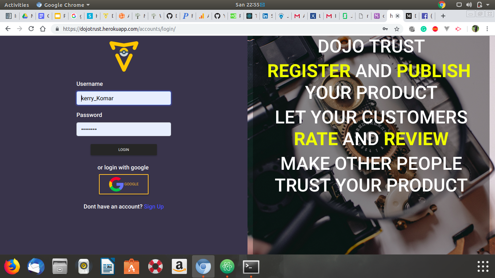
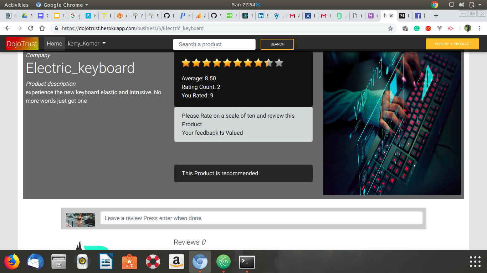

# Dojo Trust Application
#### This is a Python web application using Django  framework and Postgresql,RESTful API,2019
#### By **[Collins kipkemoi](https://github.com/kipkemoimayor)**
## Description
This is a django web application for product review where businesses can grow their brand and trust by letting reviewers review their product. Consumers can visit the site and lookup for reviews so that they can fully trust and consume the product Based on the reviews

## Setup/Installation Requirements
* A PC mainly with an Operating system.
* Python3.6 or later is installed in your PC.
* Postgresql installed
* clone the directory into your local machine
* navigate to the cloned folder by `cd Dojo_trust`
* Create a virtual environment
* run `source virtual/bin/activate`
* install Django `pip install django=1.11`
* pip install `requirements.txt`
* run `python3.6 manage.py runserver `
* The application should work

## Known Bugs
NO known bugs as at the moment please reach to us if you see any.

## Technologies Used
## main languages used are
* Python
* Material design
* WhiteNoise
* Social Authentication
* JavaScript
* CSS
* GeoLocation RESTful API
* Django
* PostgreSQL Database

## Support and contact details
Email collinskipkemoi24@gmail.com
### License
*License is under MIT 2019*
view Full License here [MIT](LICENSE)
Copyright (c) 2019 **collins kipkemoi**
This software is free to use and distribute, Therefore all rights and given to any user to modify and either use for Commercial purpose or local purpose.
